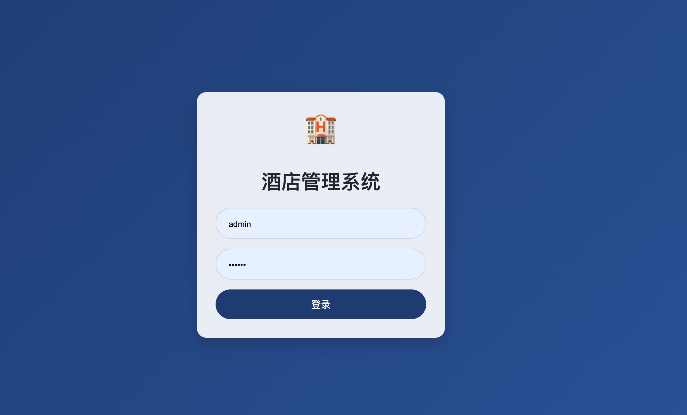
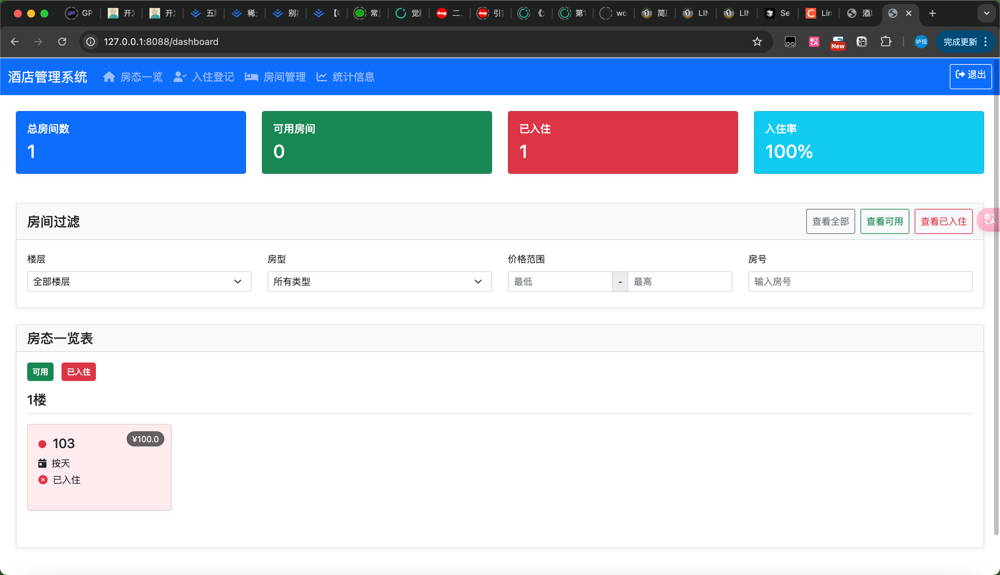
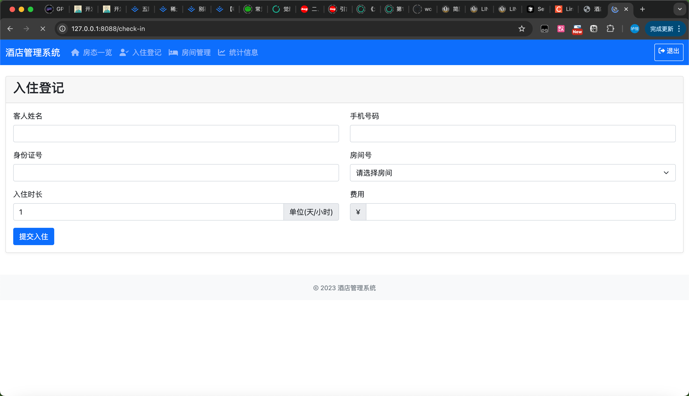
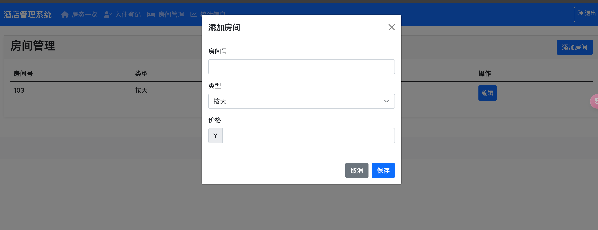
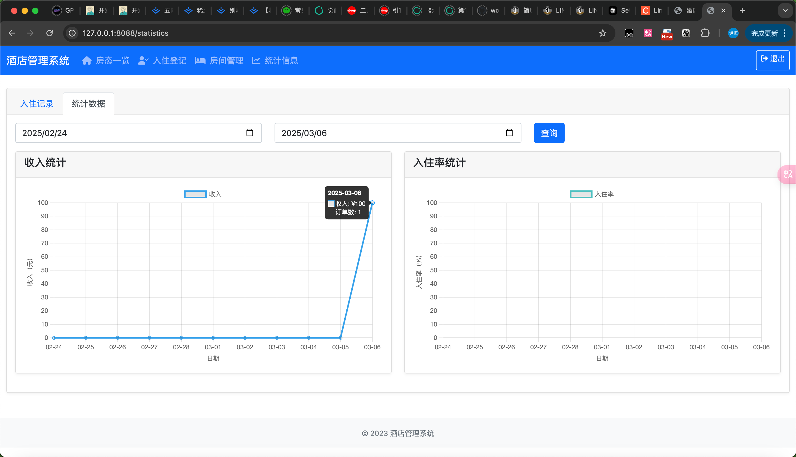

# 酒店管理系统

## 项目简介

酒店管理系统是一个基于 Flask 的应用程序，旨在帮助酒店前台管理房间、处理入住登记、查看统计信息等。该系统提供了直观的用户界面和高效的操作流程。

## 功能介绍

- **用户登录**：支持用户登录，确保系统安全。
- **房间管理**：查看、添加、编辑房间信息。
- **入住登记**：快速办理入住，自动计算费用。
- **房态一览**：直观展示房间状态，包括可用、已入住等。
- **统计信息**：查看入住记录和收入统计。

## 技术栈

- **前端**：HTML, CSS, JavaScript, Bootstrap
- **后端**：Python, Flask
- **数据库**：SQLite

## 项目截图

## 安装与运行

### 环境要求

- Python 3.x
- pip

### 安装依赖

在项目根目录下运行以下命令安装依赖：
pip install -r requirements.txt

### 启动应用
使用以下命令启动应用：
python start.py

默认情况下，应用将在 `http://localhost:8088` 上运行。

## 打包

### Windows 打包

使用以下命令打包 Windows 可执行文件：
pyinstaller --clean hotel-win.spec

### macOS 打包

使用以下命令打包 macOS 可执行文件：
pyinstaller --clean hotel-mac.spec

## 注意事项

- 确保在运行应用时，用户对应用程序所在目录有写入权限。
- 数据库文件将保存在 `data` 目录中。

## 贡献

欢迎任何形式的贡献！请提交问题或拉取请求。

